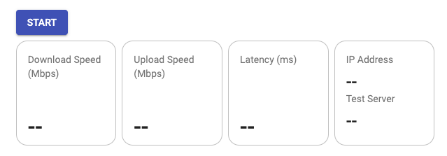

# NgxSpeedTest

Library for check internet speed test, this library using [speedof.me](https://speedof.me/index.html) API for
development. This library base on [Angular Material](https://v13.material.angular.io/) and [Bootstrap 5](https://getbootstrap.com/)

## Install

```
npm i ngx-speed-test
```

## API reference

### NgxSpeedTestModule

In order to use this library, you need to import `NgxSpeedTestModule` to your module.

app.module.ts
```ts
import {NgModule} from '@angular/core';
import {BrowserModule} from '@angular/platform-browser';
import {AppRoutingModule} from './app-routing.module';
import {AppComponent} from './app.component';
import {BrowserAnimationsModule} from '@angular/platform-browser/animations';
import {NgxSpeedTestModule} from "ngx-speed-test";


@NgModule({
  declarations: [
    AppComponent
  ],
  imports: [
    BrowserModule,
    AppRoutingModule,
    BrowserAnimationsModule,
    NgxSpeedTestModule
  ],
  providers: [],
  bootstrap: [AppComponent]
})
export class AppModule {
}
```

### NgxSpeedtestConfig

This is a list of configuration for setting the library.

```ts
export interface NgxSpeedtestConfig {
  domainName: string;
  apiKey: string;
  config?: {
    latencyTestEnabled: boolean,
    maxTestPass: number,
    progress: { enabled: boolean, verbose: boolean },
    sustainTime: number,
    testServerEnabled: boolean,
    uploadTestEnabled: boolean,
    userInfoEnabled: boolean
  },
  showBtn?: boolean;
  showUI?: boolean;
  autoStart?: boolean;
  available?: number
}
```

#### Default:

```ts
apiConfig = {
  domainName: '',
  apiKey: '',
  config: {
    latencyTestEnabled: true,
    maxTestPass: 4,
    progress: {
      enabled: true,
      verbose: true
    },
    sustainTime: 4,
    testServerEnabled: true,
    uploadTestEnabled: true,
    userInfoEnabled: true
  },
  showBtn: true,
  showUI: true,
  autoStart: false,
  available: -1
}
```

### NgxSpeedtestProgress

This is an object you will get while the API is in progress.

```ts
export interface NgxSpeedtestProgress {
  type: "download" | "upload" | "latency";
  pass: number;
  percentDone: number;
  currentSpeed: number;
  maxSpeed: number;
}
```

### NgxSpeedtestResult

This is an object you will get while the API has done.

```ts
export interface NgxSpeedtestResult {
  hostname: string;
  ip_address: string;
  latency: number;
  download: number;
  maxDownload: number;
  upload: number;
  maxUpload: number;
  jitter: number;
  testDate: string;
  testServer: string;
  userAgent: string;
}
```

### SpeedTestComponent

selector: `<ngx-speed-test>`

#### Additional properties

| Name                                          | Description                                                     |
|-----------------------------------------------|-----------------------------------------------------------------|
| @Input() config: `NgxSpeedTestConfig`         | Configuration for API                                           |
| @Input() start: `boolean`                     | API trigger, `false` by default                                 |
| @Output() started: `boolean`                  | return `true` when API is executed                              |
| @Output() progressing: `NgxSpeedtestProgress` | return `NgxSpeedtestProgress` object when speed test is running |
| @Output() completed: `NgxSpeedtestResult`     | return `NgxSpeedtestResult` object when speed test has done     |

## Usage

### Setup API configuration

app.component.ts

```ts
import {NgxSpeedtestConfig} from "ngx-speed-test";

export class AppCompomemt implements Oninit {

  apiConfig: NgxSpeedtestConfig;

  ngOnInit() {
    this.apiConfig = {
      domainName: 'localhost',
      apiKey: 'SOMxxxxxxxxxxxxx',
    }
  }
}
```

> Note: ***domainName*** and ***apiKey*** are **required**. If you don't set other property except ***domainName*** and ***apiKey***, then default configuration will be apply.

app.component.html

```html

<ngx-speedtest-api-config [config]="apiConfig"></ngx-speedtest-api-config>
```

### Logging data

- Add ***started*** output decorator, if you want to know when speed test has started.

- Add ***progressing*** output decorator, if you want to get progress of speed test.

- Add ***completed*** output decorator, if you want to get result of speed test.

app.component.ts

```ts
import {NgxSpeedtestResult, NgxSpeedtestProgress, NgxSpeedtestConfig} from "ngx-speed-test";

export class AppCompomemt implements Oninit {

  apiConfig: NgxSpeedtestConfig;

  ngOnInit() {
    this.apiConfig = {
      domainName: 'localhost',
      apiKey: 'SOMxxxxxxxxxxxxx',
    }
  }

  started(out: boolean) {
    console.log(out);
  }

  logProgress(out: NgxSpeedtestProgress) {
    console.log(out);
  }

  logResult(out: NgxSpeedtestResult) {
    console.log(out);
  }

}
```

app.component.html

```html

<ngx-speedtest-api-config
  [config]="apiConfig"
  (started)="started($event)"
  (progressing)="logProgress($event)"
  (completed)="logResult($event)">
</ngx-speedtest-api-config>
```

### UI Management

NgxSpeedTest has build in UI component.



- If you want to hide a button only, add `showBtn: false` to API configuration
- If you want to hide whole UI, add `showUI: false` to API configuration

### Apply Limit

You can set limit of running speed test by adding `available: number(interger) ` to API configuration.

> Note: If you don't set limitation, then API will use default value which is allowed user to run test as much as possible.

### Automatic Run Speed Test

You can run speed test after initialize by adding `autoStart: true (default = false)` to API configuration.

> Note: This won't reduce the times that you can run speed test if you've set the limit.

### Programmatically & Manually Run Speed Test

Add ***start*** as input decorator with, if you want trigger speed test programmatically or manually.
> Note: You can only apply boolean value or function that return boolean as a value to this input decorator. And default value is `false`

app.component.ts

```ts
import {NgxSpeedtestConfig} from "ngx-speed-test";

export class AppCompomemt implements Oninit {

  apiConfig: NgxSpeedtestConfig;
  go: boolean = false;

  ngOnInit() {
    this.apiConfig = {
      domainName: 'localhost',
      apiKey: 'SOMxxxxxxxxxxxxx',
    }
  }


}
```

app.component.html

```html

<ngx-speedtest-api-config [config]="apiConfig" [start]="go"></ngx-speedtest-api-config>
<button type="button" (click)="go = !go" mat-raised-button color="primary">go</button>
```

## About me

### Github

[@Supphawit-J](https://github.com/Supphawit-J)

### npm

[@ideajeng](https://www.npmjs.com/~ideajeng)

## Credit

[speedof.me](https://speedof.me/index.html)
